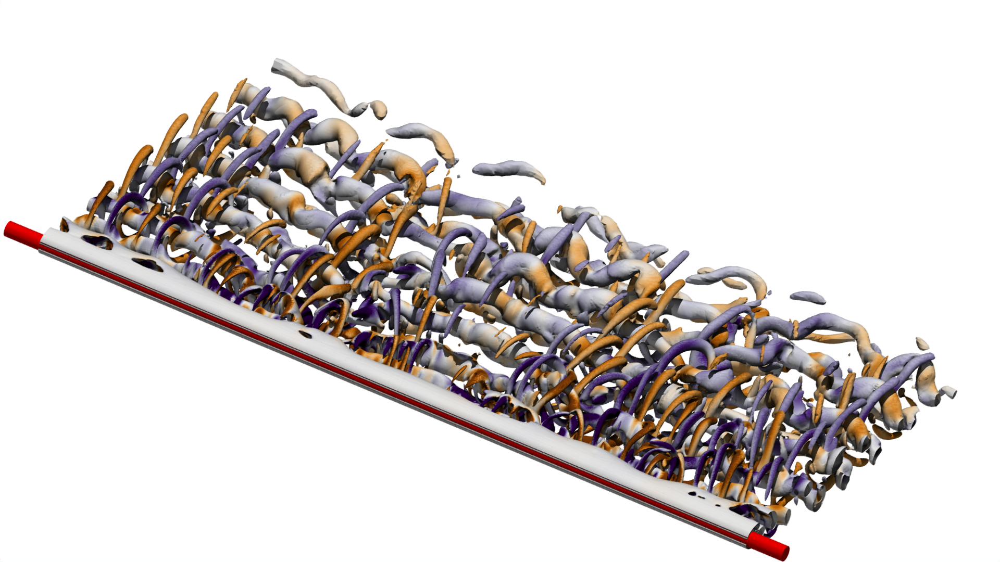

<h2>Karman Vortex Street</h2>

This repository uses
[Basilisk](http://basilisk.fr/src/INSTALL)
for simulating Karman vortex street phenomena. Follow these steps for
installation:

<pre>
$ wget http://basilisk.fr/basilisk/basilisk.tar.gz
$ tar zxf basilisk.tar.gz
$ cd basilisk/src
</pre>

On Linux:
<pre>
$ cp config.gcc config
</pre>

On macOS
<pre>
$ cp config.osx config
</pre>

<pre>
$ make ast && make qcc
$ cp qcc $HOME/.local/bin/
</pre>

See [deploy/README.md](deploy/README.md).

Two-dimensional
<pre>
Usage: cylinder [-h] [-i] [-v] -r <Reynolds number> -l <resolution level> -p <dump period> -e <end time>
Options:
  -h     Display this help message
  -v     Verbose
  -i     Enable PPM image dumping
  -r <Reynolds number>     the Reynolds number (a decimal number)
  -l <num>    Minimum resolution level (positive integer)
  -m <num>    Maximum resolution level (positive integer)
  -o <preifx>              a prefix for the output files
  -p <dump period>         the dump period (positive integer)
  -e <end time>            end time of the simulation (decimal number)

Example usage:
  ./cylinder -v -i -r 100 -l 7 -m 10 -p 100 -e 2 -o h
</pre>
and three-dimensional
<pre>
Usage: cylinder [-h] [-v] [-a] [-F] [-r <Reynolds number> -l <resolution level> -m <maximum resolution level> -o <prefix> -p <dump period> -e <end time> -f <force file> -S cylinder|sphere -z <domain size> [-b <boundaries>] [-d <dump file>]

Options:
  -h          Display this help message
  -v          Verbose
  -F          Output the full field
  -a          Use adoptation
  -b <string> Periodic boundary (ft|f|t: front (f), top (t) or both, default is symmetric boundary)
  -r <num>    Reynolds number
  -t <num>    dt
  -l <num>    Minimum resolution level (positive integer)
  -m <num>    Maximum resolution level (positive integer)
  -o <string> Prefix for the output files
  -p <num>    Dump period (positive integer)
  -e <num>    End time of the simulation (decimal number)
  -f <file>   Output force file
  -S <string> Specify shape (cylinder|sphere)
  -d <file>   Restart simulation from the dump file
  -z <num>    Domain size

  npe: 1
Example usage:
  ./cylinder -v -r 100 -l 7 -m 10 -p 100 -e 2 -z 2.5 -S sphere
  ./cylinder -v -r 100 -l 7 -m 10 -p 100 -e 2 -f force.dat -z 2.5 -S cylinder -o h -b t
</pre>

<h2>Results</h2>

