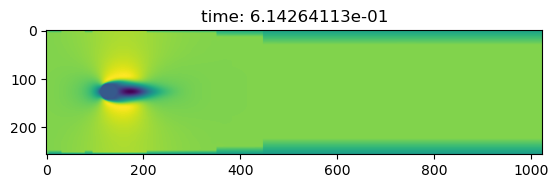

Compile

<pre>
$ make
c99 -g -O2 -fopenmp -o cylinder cylinder.c  -lm
$ ./cylinder -h
usage: cylinder [-i] [-s] [-z <number of cells>] -r <Reynolds number> -l <resolution level> -p <dump period>
  -s     dump surface file
  -i     dump PPM images
</pre>

Run

<pre>
$ ./cylinder -i -s -r 100 -l 10 -p 100
cylinder: 000000000 0.0000000000000000e+00
cylinder: 000000100 1.7213886775752063e-01
cylinder: 000000200 3.8753726801562310e-01
cylinder: 000000300 6.1425090121064396e-01
...
</pre>

To plot the velocity and pressure fields.
<pre>
$ python plot.py a.000000300.xdmf2
0.6142641127864911 (1024, 256)
</pre>

open `ux.png`, `uy.png`, or `p.png`.

Plot vorticity on the surface of the cylinder

<pre>
$ python surface.py surface.000000300.raw
</pre>

open `omega.png`

Run and dump zoomed grid

<pre>
$ ./cylinder -z 1024 -r 100 -l 10 -p 100
</pre>

<pre>
$ python plot.py z.000000300.xdmf2
0.6142641127864911 (1024, 1024)
</pre>

open `ux.png`, `uy.png`, or `p.png`.

